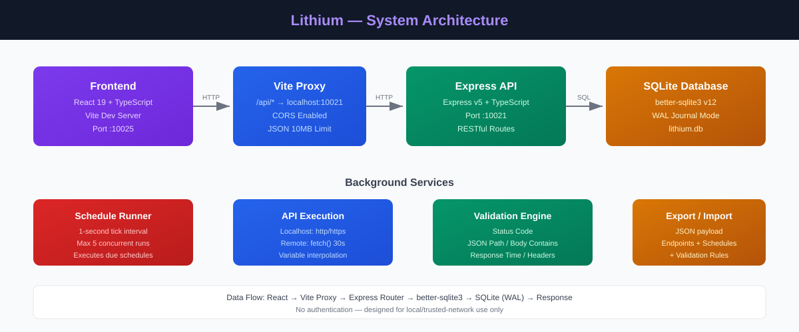
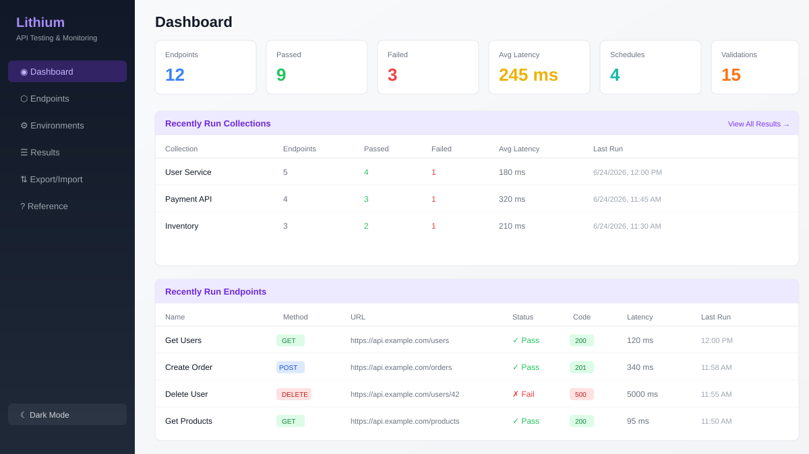
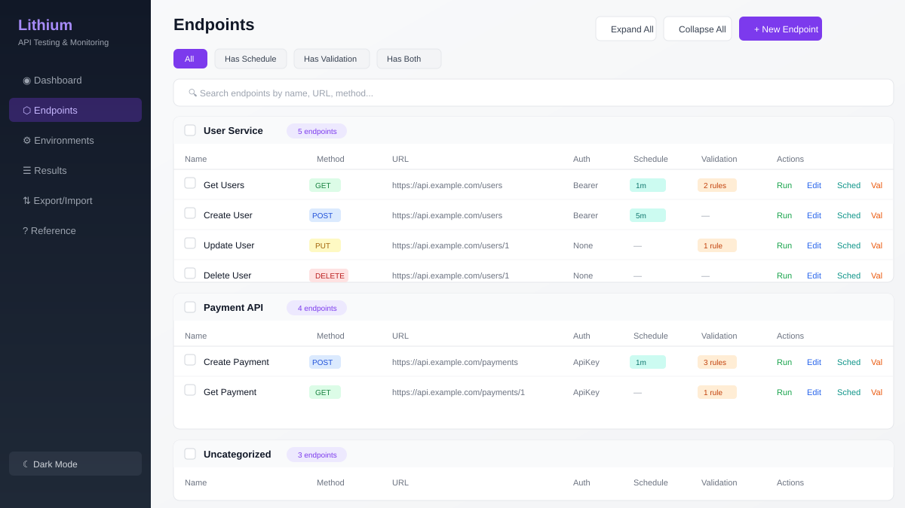
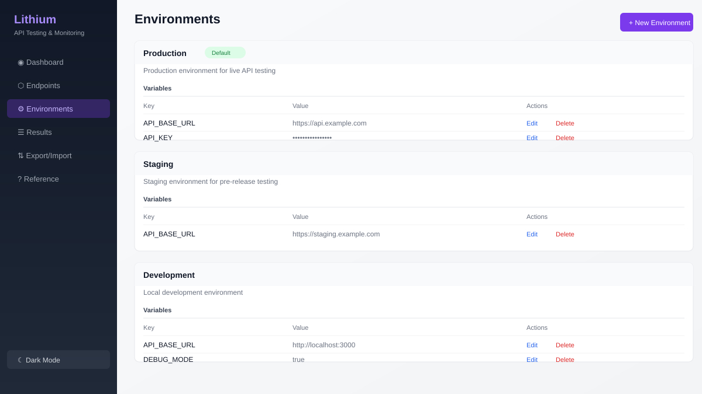
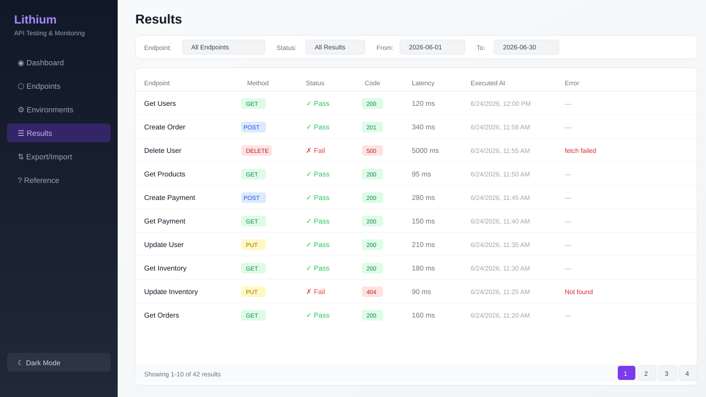

# Lithium — API Testing & Monitoring Platform

**TechTaa Solutions — Lithium**

A full-stack API testing and monitoring application that allows users to define API endpoints, execute HTTP requests, schedule recurring test runs, validate responses against configurable rules, and track historical results. The platform provides a dashboard for at-a-glance health monitoring.

**Target Audience:** Developers, QA engineers, and API administrators who need to test, monitor, and validate API endpoints on a recurring basis.

---

## Screenshots

### System Architecture



### Dashboard



### Endpoints Management



### Environments



### Results & History



---

## Table of Contents

- [Screenshots](#screenshots)
- [Prerequisites](#prerequisites)
- [Installation](#installation)
- [Application Startup](#application-startup)
  - [IP & Port Configuration](#ip--port-configuration)
  - [Startup Methods](#startup-methods)
- [Tech Stack](#tech-stack)
- [Project Structure](#project-structure)
- [Documentation](#documentation)
  - [System Architecture](#system-architecture)
- [Scripts](#scripts)
- [License](#license)

---

## Prerequisites

Before installing Lithium, ensure you have the following installed on your system:

| Requirement | Version | Notes |
| :--- | :--- | :--- |
| **Node.js** | v18+ (recommended v20+) | Required for running the backend and frontend |
| **npm** | v9+ | Comes bundled with Node.js |
| **AutoHotkey v2** (optional) | v2.0+ | Only needed if using the `start-lithium.ahk` launcher script |

---

## Installation

### 1. Clone the Repository

```bash
git clone <repository-url>
cd "Lithium App"
```

### 2. Install npm Packages

Navigate to the `frontend` directory and install all required dependencies:

```bash
cd frontend
npm install
```

This installs all runtime and development dependencies defined in `package.json`, including:

- **Runtime dependencies:** `express`, `better-sqlite3`, `cors`, `react`, `react-dom`, `react-router-dom`, `jsonpath-plus`, `tsx`, `undici`
- **Development dependencies:** `vite`, `typescript`, `tailwindcss`, `eslint`, `concurrently`, `@vitejs/plugin-react`, and related type definitions

> **Note:** The `node_modules` folder is created inside `frontend/` and is excluded from version control via `.gitignore`.

---

## Application Startup

### IP & Port Configuration

Lithium runs two services locally:

| Service | IP Address | Port | Description |
| :--- | :--- | :--- | :--- |
| **Backend API (Express)** | `http://localhost` | **10021** | RESTful API server |
| **Frontend (Vite Dev Server)** | `http://localhost` | **10025** | React web UI |

The Vite dev server proxies all `/api/*` requests to the backend at `http://localhost:10021`.

### Startup Methods

#### Method 1: Start Both Services (Recommended)

From the `frontend` directory, run:

```bash
npm run dev
```

This uses `concurrently` to launch **both** the Express API server and the Vite frontend simultaneously:

- **API Server:** `http://localhost:10021`
- **Web UI:** `http://localhost:10025`

#### Method 2: Start Services Individually

**Start the backend API only:**

```bash
npm run dev:api
```

**Start the frontend web UI only:**

```bash
npm run dev:web
```

#### Method 3: Production Build & Preview

Build the application for production:

```bash
npm run build
```

Preview the production build:

```bash
npm run preview
```

#### Method 4: AutoHotkey Launcher (Windows)

If you have AutoHotkey v2 installed, you can double-click `start-lithium.ahk` in the project root. It will prompt you to choose:

- **Yes** — Start both backend + frontend
- **No** — Start frontend only

The launcher automatically opens the web UI in your default browser.

---

## Tech Stack

### Frontend Layer
- **Framework:** React 19
- **Language:** TypeScript 6
- **Routing:** React Router v6
- **Styling:** Tailwind CSS v4 (via `@tailwindcss/vite` plugin)
- **Build Tool:** Vite 8 dev server
- **State Management:** React Context (`ThemeContext`, `ToastContext`)

### Backend/API Layer
- **Runtime:** Node.js
- **Framework:** Express v5
- **Language:** TypeScript (executed via `tsx` in watch mode for development)
- **CORS:** Enabled
- **Body Parsing:** JSON with 10 MB limit

### Data Persistence Layer
- **Database:** SQLite via `better-sqlite3` v12 (synchronous, high-performance driver)
- **Journal Mode:** WAL (Write-Ahead Logging)
- **Foreign Keys:** Enforced
- **Database File:** `lithium.db` (auto-created in `frontend/` on first run)

### External Integrations
- **None.** Uses native Node.js `http`/`https` modules and global `fetch()` for outbound HTTP calls.
- Self-signed certificate bypass for localhost targets via `rejectUnauthorized: false`.

---

## Project Structure

```
Lithium App/
├── docs/                          # Project documentation
│   ├── Architecture.md            # System architecture specification
│   ├── Session-Details.md         # Engineering sprint & session ledger
│   └── images/                    # Screenshots & diagrams
│       ├── architecture.svg       # System architecture diagram
│       ├── dashboard.svg          # Dashboard screenshot
│       ├── endpoints.svg          # Endpoints page screenshot
│       ├── environments.svg       # Environments page screenshot
│       └── results.svg            # Results page screenshot
├── frontend/                      # Main application (frontend + backend)
│   ├── server/                    # Express backend
│   │   ├── index.ts               # Server entry point (port 10021)
│   │   ├── db.ts                  # SQLite database setup & schema
│   │   ├── routes/                # API route handlers
│   │   ├── services/              # Business logic services
│   │   └── types.ts               # Shared TypeScript types
│   ├── src/                       # React frontend
│   │   ├── pages/                 # Page components
│   │   ├── components/            # Reusable UI components
│   │   ├── services/              # Frontend API client
│   │   ├── contexts/              # React context providers
│   │   └── types/                 # Frontend TypeScript types
│   ├── index.html                 # HTML entry point
│   ├── package.json               # Dependencies & scripts
│   ├── vite.config.ts             # Vite config (port 10025, proxy)
│   └── lithium.db                 # SQLite database (auto-generated)
├── start-lithium.ahk              # AutoHotkey launcher script
└── README.md                      # This file
```

---

## Documentation

The full technical documentation is maintained in the [`docs/`](docs/) folder. Below is a summary of each document.

### System Architecture

**Source:** [`docs/Architecture.md`](docs/Architecture.md)

#### Data Flow & Communication Lifecycle

1. **Core Feature Read/Write Flow:**
   Frontend (React) → Vite dev server (port 10025) → Vite proxy (`/api/*` → `http://localhost:10021`) → Express router → Route handler → `better-sqlite3` query → SQLite database (WAL) → Response returned through chain.

2. **Schedule Runner Flow:** The `scheduleRunner.ts` service runs a background interval (1-second tick) within the Express process. On each tick it queries `Schedules` for due items, executes the associated endpoint via `apiExecution.ts`, validates the result via `validation.ts`, writes results to `ApiResults`, and updates the next run time.

3. **Endpoint Execution Flow:** User triggers a run or bulk-run → Express route handler → `executeEndpoint()` in `apiExecution.ts` → builds request headers/auth → detects localhost URLs (uses Node.js `http`/`https` with `rejectUnauthorized: false`) vs. remote URLs (uses global `fetch()` with 30s timeout) → returns `ExecutionResult` → validates against rules → persists to `ApiResults`.

4. **Export/Import Flow:** Selecting endpoints for export → `GET /api/endpoints/export?ids=...` → joins `ApiEndpoints`, `Collections`, `Schedules`, `ValidationRules` → returns structured JSON payload. Import reverses the process via `POST /api/endpoints/import`, auto-creating missing collections.

#### Authentication

No authentication layer is implemented. The application is designed for local/trusted-network use only.

---

## Scripts

All scripts are run from the `frontend/` directory:

| Command | Description |
| :--- | :--- |
| `npm run dev` | Start both API server and web UI (concurrently) |
| `npm run dev:api` | Start only the Express API server (watch mode) |
| `npm run dev:web` | Start only the Vite web UI |
| `npm run build` | Type-check and build for production |
| `npm run start` | Start the API server (production mode) |
| `npm run lint` | Run ESLint on the codebase |
| `npm run preview` | Preview the production build |

---

## License

This project is proprietary and maintained by **TechTaa Solutions**.
